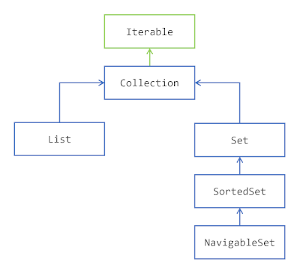

[The Collection FrameWork](./README.md) |[<<](./Storing_Data_Using_the_Collections_Framework.md)  |  Getting to Know the Collection Hierarchy | [>>](./Storing_Elements_in_a_Collection.md)[The Collection FrameWork](./README.md) |[<<](./Storing_Data_Using_the_Collections_Framework.md)  |  Getting to Know the Collection Hierarchy | [>>](./Storing_Elements_in_a_Collection.md)

##### Avoiding Getting Lost in the Collection Hierarchy
* The Collections Framework is divided in several hierarchies of interfaces and classes. The first one you need to understand is the following: the Collection interface hierarchy.
* 
* Note that some interfaces have been omitted, which you will see later.
###### The Iterable Interface
* The first interface of this hierarchy is the Iterable interface, and it is in fact not part of the Collections Framework. It is still worth mentioning here because it is the super interface of the Collection interface, and thus of all the interfaces of this hierarchy. 
* The Iterable interface is an addition of Java SE 5 (2004). An object that implements Iterable is an object that you can iterate over. It has been added in Java SE 5 along with the for each pattern of code.
```
Collection<String> collection = ...;
for (String element: collection) {
// do someting with element
}
```
* You may already know that you can iterate over any collection using this pattern, or any array. It turns out that in fact any instance of Iterable may be used here. 
* To implement the Iterable interface is really easy: all you need to do is provide an instance of another interface, Iterator, that you are going to see in the following.
##### Storing Elements in a Container with the Collection Interface
* All the other interfaces are about storing elements in containers. 
* The two interfaces List and Set both share a common behavior, which is modeled by the Collection interface. The Collection interface models several operations on containers of elements. Without diving in the technical details (yet!), here is what you can do with a Collection:
1. add or remove elements; 
2. test for the presence of a given element; 
3. ask for the number of elements contained, or if this collection is empty; 
4. clear this content.
* Since a Collection is a set of elements, there also set operations defined on the Collection interface:
1. testing for the inclusion of a set in another set; 
2. union; 
3. intersection; 
4. complement.
* Lastly, the Collection interface also models different ways of accessing its elements:
1. you can iterate over the elements of a collection, through the use of an iterator; 
2. you can create a stream on these elements, that can be parallel.
* Of course, all these operations are also available on List and Set. So what does make the difference between a plain instance of Collection and an instance of Set or an instance of List?
##### Extending Collection with List
* The difference between a List of elements and a Collection of elements, is that a List remembers in what order its elements have been added. 
* The first consequence is that if you iterate over the elements of a list, the first element you will get is the first that has been added. Then you will get the second one, and so on until all the elements have been seen. So the order you will iterate over the elements is always the same, it is fixed by the order in which these elements have been added. You do not have this guarantee with a plain Collection nor for a Set.
* It turns out that some implementations of Set provided by the Collections Framework happen to always iterate over the elements in the same order. This is an accidental effect, and your code should not rely on this behavior. 
* There is a second consequence, maybe not as clear as the first one, which is that the elements of a list have an index. Querying a collection for its first element does not make sense. Querying a list for its first element does make sense, since a list does remember that. 
* How are those indexes handled? Well, once again, this is the responsibility of the implementation. The first role of an interface is to specify a behavior, not to tell how an implementation should achieve that. 
* As you will see it, the List interface adds new operations to the Collection interface. As the elements of a list have an index, you can do the following with that index.
1. Get an element at a specific index, or delete it 
2. Insert an element or replace an element at a specific position 
3. Get a range of elements between two indexes
##### Extending Collection with Set
* The difference between a Set of elements and a Collection of elements, is that you cannot have duplicates in a Set. You can have several instances of the same class that are equal in a Collection, or even the same instance more than once. This is not allowed in a Set. How is this enforced is the responsibility of the implementation, you will see that later in this tutorial. 
* One of the consequences of this behavior, is that adding an element to a Set may fail. 
* Then you may ask yourself: can I have a container that prevents having duplicates, and in which elements have an index? The answer is not that simple. The Collections Framework gives you an implementation of Set with which you will iterate over the elements always in the same order, but these elements do not have an index, so this class does not implement List. 
* This difference in behavior does not bring any new operations in the Set interface.
##### Sorting the element of a Set with SortedSet and NavigableSet
* The Set interface has itself two extensions: SortedSet and NavigableSet.
* The **SortedSet interface** maintains its elements sorted in the ascending order. Once again, how this is enforced is the responsibility of the implementation, as you will see it later. 
* To be able to sort them, a SortedSet needs to compare your elements. How can it achieve that? Well, there are two standard mechanisms defined in the Java language for that.
1. Your elements may implement the Comparable interface, and provide a compareTo() method 
2. You give a Comparator to the SortedSet so that it can compare them.
* Even if your elements are Comparable, you can still provide a Comparator when building a SortedSet. This may prove useful if you need to sort your elements in an order that is different from the one implemented in the compareTo() method.
* What is the difference between sorting and ordering? A List keeps its elements in the order they have been added, and a SortedSet keeps them sorted. Sorting elements means that the first element you get while traversing a set will be the lowest one, in the sense of a given comparison logic. Ordering elements means that the order in which you added them in a list is kept throughout the life of this list. So the first element you get while traversing a list is the first that has been added to it. 
* The SortedSet adds several operations to Set. Here is what you can do with a SortedSet.
1. You can get the lowest element, and the largest element of the set 
2. You can extract a headSet and a tailSet of all the elements lesser than, or greater than a given element.
* Iterating over the elements of a SortedSet will be made from the lowest element to the greatest. 
* The **NavigableSet** does not change the behavior of a SortedSet. It adds several vey useful operations on SortedSet, among them the possibility to iterate over the elements in the descending order. You will see more details ont that later.


[The Collection FrameWork](./README.md) |[<<](./Storing_Data_Using_the_Collections_Framework.md)  |  Getting to Know the Collection Hierarchy | [>>](./Storing_Elements_in_a_Collection.md)[The Collection FrameWork](./README.md) |[<<](./Storing_Data_Using_the_Collections_Framework.md)  |  Getting to Know the Collection Hierarchy | [>>](./Storing_Elements_in_a_Collection.md)
