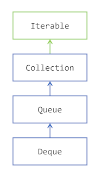

#### Storing Elements in Stacks and Queues
##### Finding Your Way in the Queue Hierarchy
* Java SE 5 saw the addition of a new interface in the Collections Framework: the Queue interface, further extended in Java SE 6 by the Deque interface. The Queue interface is an extension of the Collection interface.
* 
##### Pushing, Popping and Peeking
* The stack and queue structures are classic data structures in computing. Stacks are also called LIFO stacks, where LIFO stands for Last In, First Out. Queues are known as FIFO: First In First Out. 
* These structures are very simple and gives you three main operations.
1. push(element): adds an element to the queue, or the stack 
2. pop(): removes an element from the stack, that is, the youngest element added 
3. poll(): removes an element from the queue, that is, the oldest element added 
4. peek(): allows you to see the element you will get with a pop() or a poll(), but without removing it from the queue of the stack.
* There are two reasons to explain the success of these structures in computing. The first one is their simplicity. Even in the very early days of computing, implementing these was simple. The second one is their usefulness. Many algorithms use stacks for their implementations.

#### Modeling Queues and Stacks
* The Collections Framework gives you two interfaces to model queues and stacks:
1. the **Queue** interface models a queue; 
2. the **Deque** interface models a double ended queue (thus the name). You can push, pop, poll and peek elements on both the tail and the head of a Deque, making it both a queue and a stack.
* Stacks and queues are also widely used in concurrent programming. These interfaces are further extended by more interfaces, adding methods useful in this field. These interfaces, BlockingQueue, BlockingDeque and TransferQueue, are at the intersection of the Collections Framework and concurrent programming in Java, which is outside the scope of this tutorial.
* Both the Queue and the Deque interfaces add behavior to these three fundamental operations to deal with two corner cases.
1. A queue may be full and not able to accept more elements 
2. A queue may be empty and cannot return an element with a pop, poll, nor the peek operation.
* In fact this question needs to be answered: how does an implementation should behave in these two cases?

##### Modeling FIFO Queues with Queue
* The Queue interface gives you two ways of dealing with these corner cases. An exception can be thrown, or a special value can be returned. 
* Here is the table of the methods Queue gives you.

| Operation | Method             | Behavior when the queue is full or empty          |
|-----------|--------------------|--------------------------------------------------|
| push      | `add(element)`      | throws an `IllegalStateException`                |
|           | `offer(element)`    | returns `false`                                  |
| poll      | `remove()`          | throws a `NoSuchElementException`                |
|           | `poll()`            | returns `false`                                  |
| peek      | `element()`         | throws a `NoSuchElementException`                |
|           | `peek()`            | returns `null`                                   |

##### Modeling LIFO Stacks and FIFO Queues with Deque
* Java SE 6 added the Deque interface as an extension of the Queue interface. Of course, the methods defined in Queue are still available in Deque, but Deque brought a new naming convention. So these methods have been duplicated in Deque, following this new naming convention. 
* Here is the table of the methods defined in Deque for the FIFO operations. 

### FIFO Operation

| Operation | Method               | Behavior when the queue is full or empty          |
|-----------|----------------------|--------------------------------------------------|
| push      | `addLast(element)`    | throws an `IllegalStateException`                |
|           | `offerLast(element)`  | returns `false`                                  |
| poll      | `removeFirst()`       | throws a `NoSuchElementException`                |
|           | `pollFirst()`         | returns `null`                                   |
| peek      | `getFirst()`          | throws a `NoSuchElementException`                |
|           | `peekFirst()`         | returns `null`                                   |

* And here is the table of the methods defined in Deque for the LIFO operations.

### LIFO Operation

| Operation | Method               | Behavior when the queue is full or empty          |
|-----------|----------------------|--------------------------------------------------|
| push      | `addFirst(element)`   | throws an `IllegalStateException`                |
|           | `offerFirst(element)` | returns `false`                                  |
| pop       | `removeFirst()`       | throws a `NoSuchElementException`                |
|           | `pollFirst()`         | returns `null`                                   |
| peek      | `getFirst()`          | throws a `NoSuchElementException`                |
|           | `peekFirst()`         | returns `null`                                   |

* The Deque naming convention is straightforward and is the same as the one followed in the Queue interface. There is one difference though: the peek operations are named getFirst() and getLast() in Deque, and element() in Queue. 
* Moreover, Deque also defines the methods you would expect in any queue or stack class:
1. push(element): adds the given element to the head of the double ended queue 
2. pop(): removes and return the element at the head of the double ended queue 
3. poll(): does the same at the tail of the double ended queue 
4. peek(): shows you the element at the tail of the double ended queue.
* In case there is no element to pop, poll, or peek, then a null value is returned by these methods.

##### Implementing Queue and Deque
* The Collections Framework gives you three implementations of Queue and Deque, outside the concurrent programming space:
1. ArrayDeque: which implements both. This implementation is backed by an array. The capacity of this class automatically grows as elements are added. So this implementation always accepts new elements. 
2. LinkedList: which also implements both. This implementation is backed by a linked list, making the access to its first and last element very efficient. A LinkedList will always accept new elements. 
3. PriorityQueue: that only implements Queue. This queue is backed by an array that keeps its elements sorted by their natural order or by an order specified by a Comparator. The head of this queue is always the least element of the queue with respect to the specified ordering. The capacity of this class automatically grows as elements are added.

##### Staying Away from the Stack Class
* It may seem tempting to use the Stack class offered by the JDK. This class is simple to use and to understand. It has the three expected methods push(element), pop(), and peek(), and seeing this class referenced in your code makes it perfectly readable. 
* It turns out that this class is an extension of the Vector class. Back in the days before the Collections Framework was introduced, Vector was your best choice to work with a list. Although Vector is not deprecated, its usage is discouraged. So is the usage of the Stack class. 
* The Vector class is thread safe, and so is Stack. If you do not need the thread safety, then you can safely replace its usage with Deque and ArrayDeque. If what you need is a thread-safe stack, then you should explore the implementations of the BlockingQueue interface.